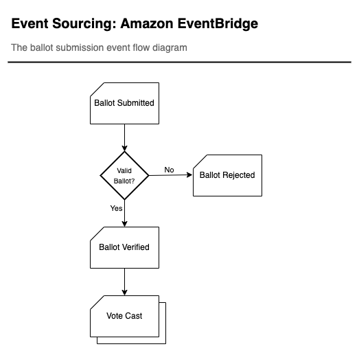
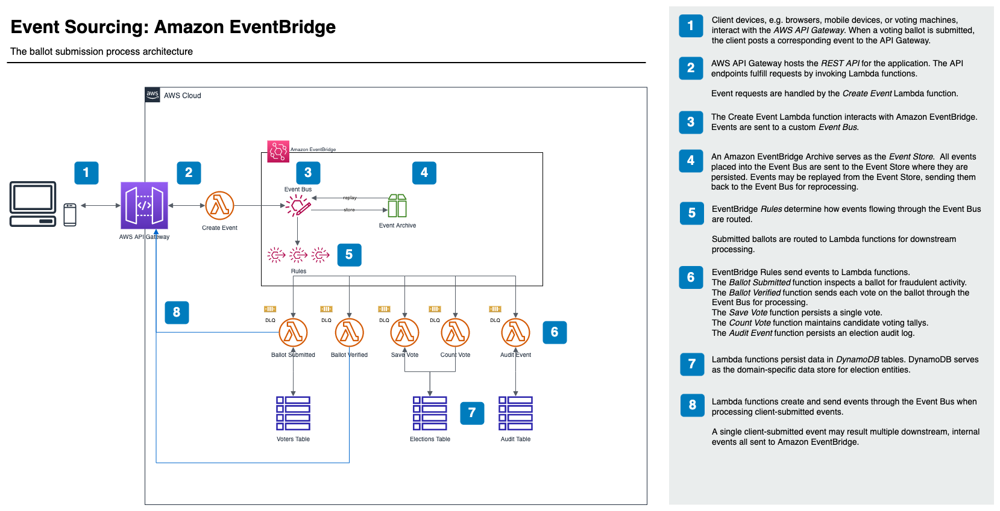

# Experiment: Event Sourcing Pattern with Amazon EventBridge and Lambda

This project provides an example of the _Event Sourcing_ architectural pattern using Amazon EventBridge as the event store and AWS Lambda functions as event processors as descibed in this [AWS Prescriptive Guidance][es-aws].

## About Event Sourcing

### Summary

Rather than storing just the current state of the application, data is stored as a series of events. These events are persisted in an _Event Store_. Microservices (re)play events from the store to perform business logic or calculate/mutate the state of their own domain.

### When to consider using

The event souring pattern is an approach for data persistence in microservices. However, as with any design choice, the requirements should dictate selection.

Consider using event sourcing if/when...

1. The application uses events to create (or recreate) state.
1. Data access is read-heavy with low to moderate write activity.
1. You need to minimize or eliminate data store write conflicts.
1. You need to decouple data intake from the sequence of tasks that result from that submission.
1. It is 'OK' for data to be eventually consistent due to the nature of event publication and propagation.
1. There is (already) a stream of events emitted by the application.
1. There is a need to determine application state at a point in time or to recreate the application state at a given point in time.

> **NOTE:** When the Event Sourcing pattern is employed, the [Saga pattern][saga-aws] should also be used to ensure consistency of application state.

### When to avoid using

The event sourcing pattern should be avoided if/when...

1. Real time data consistency is required.
1. The application domain is small and/or simple.
1. Audit trails, change history, and the ability to recreate state are not needed.
1. Data store write conflicts rarely or never occur.

## Experiment Scenario

The scenario used to illustrate the Event Sourcing pattern is an _Election_ application. Specifically, it depicts the process of submitting Ballots to be processed.

Ballots are submitted by application clients, e.g. web browsers, mobile devices, voting machines, etc. A ballot submission is posted to the `/events` REST API endpoint which is handled by the _Create Event_ Lambda function and serves as the entry point to our Event Sourcing pattern. After performing rudimentary validation of the ballot, the _Create Event_ function sends a `Ballot Submitted` event to Amazon Event Bridge.

Ballot Submitted events are handled by the _Ballot Submission_ function of the Voter microservice. The function verifies that the ballot is authentic, that it was previously issued to the submitting voter, and that it has not already been processed. If ballot verification succeeds, the function augments the event payload with Voter information and sends a `Ballot Verified` event to Amazon EventBridge. If it fails, a `Ballot Rejected` event is sent.

Ballot Verified events are handled by the _Ballot Processing_ function of the Election microservice. For each Vote within the Ballot, a `Vote Cast` event is sent to Amazon EventBridge.

Vote Cast events are handled by multiple functions in the Election microservice. The _Save Vote_ function persists the details of the Vote. The _Count Vote_ function simply increments a counter of votes cast for each candidate in the election.

All events are handled by the _Audit_ microservice. This service contains functions which preserve a detailed log of events for all election related entities such as Elections, Candidates, Voters, and Ballots.

### Event Flow



### Architecture



## Installation

This experiment consists of 4 components. Each component is deployed to AWS separately. Follow the links below to find detailed component installation instructions.

First, deploy the [events](./events/README.md) component.

After the events component deployment is complete, deploy the [elections](./elections/README.md), [voters](./voters/README.md), and [audit](./audit/README.md) components. These 3 components may be deployed in any order and may be deployed in parallel if you choose. They simply depend upon resources created by the _events_ component.

> **NOTE:** When removing these components from AWS, remove the _events_ component last.

## Running the Experiment

To run the experiment, you will POST to the `/events` API Gateway endpoint.

If you noted the `/events` URL when you deployed the _events_ component to AWS, proceed to the next step.

If you need to discover the URL for the endpoint, open a terminal. At the prompt change to the `/events` project directory and run the following command.

```
yarn sls info
```

### Create Event

To create an event, you send a HTTP POST requst to the `/events` endpoint. You may use an API client such as [Postman](https://postman.com/downloads), or issue a curl command structured like this:

```
% curl --request POST \
       --header 'Content-Type: application/json' \
       --data-raw '{"type":"Ballot Submitted","detail":{"ballotId":"B000001","voterId":"V000001","votes":[{"electionId":"E000001","candidateId":"C000001"},{"electionId":"E000002","candidateId":"C000002"}]}}' \
       --verbose \
       {your-gateway-endpoint-url}
```

When you deployed the application, the deployment scripts bootstrap the system with data. The following are prepared events to illustrate the experiment scenarios.

The REST API endpoint responds with event submission details. Meanwhile, Amazon EventBridge processes the events resulting from ballot submission. CloudWatch logs for the Lambda functions detail the results of event processing.

DynamoDB tables are updated as well. The BALLOT item in the _Voters_ table is updated from `ISSUED` to `SUBMITTED`. VOTE items are created in the _Elections_ table and the vote count is incremented on the appropriate CANDIDATE item. The _Audit_ table captures details of each event which passes through the system.

### Successful Ballot Submissions

> **NOTE:** A ballot may be submitted only once. The system records it's submission and duplicates are rejected.

#### Scenario 1: Voter Joe casts votes for Candidates Beth and Delores

```
curl --request POST \
       --header 'Content-Type: application/json' \
       --data-raw '{"type":"Ballot Submitted","detail":{"ballotId":"49aef2","voterId":"b7a42e","votes":[{"electionId":"6353a9","candidateId":"f5484e"},{"electionId":"cc4822","candidateId":"ad0031"}]}}' \
       --verbose \
       {your-gateway-endpoint-url}
```

#### Scenario 2: Voter Abby casts votes for Candidates Carla and Elena

```
curl --request POST \
       --header 'Content-Type: application/json' \
       --data-raw '{"type":"Ballot Submitted","detail":{"ballotId":"de2ac4","voterId":"e579df","votes":[{"electionId":"6353a9","candidateId":"16eb70"},{"electionId":"cc4822","candidateId":"3391e4"}]}}' \
       --verbose \
       {your-gateway-endpoint-url}
```

#### Scenario 3: Voter Robert casts votes for Candidates Carla and Elena

```
curl --request POST \
       --header 'Content-Type: application/json' \
       --data-raw '{"type":"Ballot Submitted","detail":{"ballotId":"73a342","voterId":"a3aa4f","votes":[{"electionId":"6353a9","candidateId":"16eb70"},{"electionId":"cc4822","candidateId":"3391e4"}]}}' \
       --verbose \
       {your-gateway-endpoint-url}
```

### Rejected Ballot Submissions

#### Scenario 1: Ballot Already Submitted

```
curl --request POST \
       --header 'Content-Type: application/json' \
       --data-raw '{"type":"Ballot Submitted","detail":{"ballotId":"2a8c1e","voterId":"b7a42e","votes":[{"electionId":"6353a9","candidateId":"16eb70"},{"electionId":"cc4822","candidateId":"3391e4"}]}}' \
       --verbose \
       {your-gateway-endpoint-url}
```

### Resetting Experiment Data

As noted above, ballots may only be processed one time. Subsequent submissions result in `Ballot Rejected` events since the ballot has already been processed.

To reset the DynamoDB tables to their original state, perform the following steps in the AWS Console for DynamoDB and in your terminal.

1. In the AWS Console for DynamodDB, delete all items in the _Audit_ table.
1. In the AWS Console for DynamoDB, delete all items in the _Elections_ table.
1. At a terminal prompt, in the `/elections` directory, run `yarn run init`
1. At a terminal promot, in the `/voters` direcotry, run `yarn run init`.

## Related Information

[Event Sourcing | Martin Fowler][es-martin-fowler]  
[Event Sourcing pattern | AWS Prescriptive Guidance][es-aws]  
[Event Sourcing pattern - Cloud Design Patterns | Microsoft][es-microsoft]  
[Saga pattern | AWS Prescriptive Guidance][saga-aws]  
[DynamoDB Single-Table Design | Alex DeBrie][dynamo-std-debrie]

[es-martin-fowler]: https://martinfowler.com/eaaDev/EventSourcing.html 'Event Sourcing | Martin Fowler'
[es-aws]: https://docs.aws.amazon.com/prescriptive-guidance/latest/modernization-data-persistence/service-per-team.html 'Event Sourcing pattern | AWS Prescriptive Guidance'
[es-microsoft]: https://docs.microsoft.com/en-us/azure/architecture/patterns/event-sourcing 'Event Sourcing pattern - Cloud Design Patterns | Microsoft'
[saga-aws]: https://docs.aws.amazon.com/prescriptive-guidance/latest/modernization-data-persistence/saga-pattern.html 'Saga pattern | AWS Prescriptive Guidance'
[dynamo-std-debrie]: https://www.alexdebrie.com/posts/dynamodb-single-table/ 'The What, Why, and When of Single-Table Design with DynamoDB'
