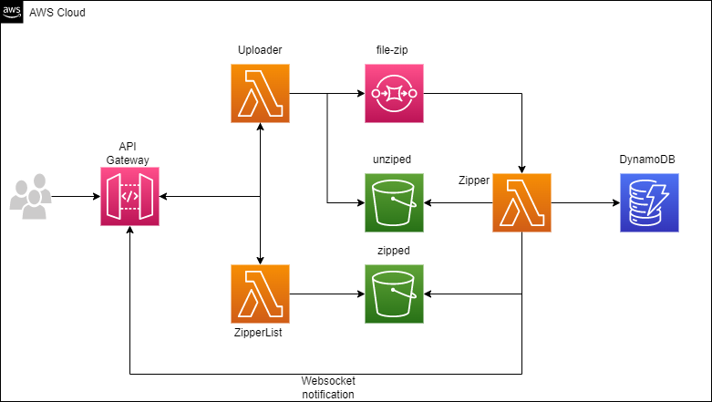

*Project to learn serverless frameworks*
==

`In this experiment, was used many services from AWS like API Gateway, AWS Lambda, S3, SQS and DynamoDb.`

**This experiment contains two restful APIs:**
    
* /file/save - to upload file in multipart/form-data, `respecting the restriction about payload size of API Gateway (10mb), as well the limit of payload for AWS Lambda functions (6mb)`

* file/list - to list files that were uploaded and have already been zipped.

**The files will be stored in an S3 bucket, splited into "zipped" and "unzipped" folder**

**When a "file/save" request will be made, two things will happen, one is save file into a S3 bucket, and another one, will be the generation of SQS message to be listened for another AWS Lambda that will make the zip process.**

---
**It also contains a websocket endpoint for the purpose of notifying customers when an uploaded file has finished the compression process.**
